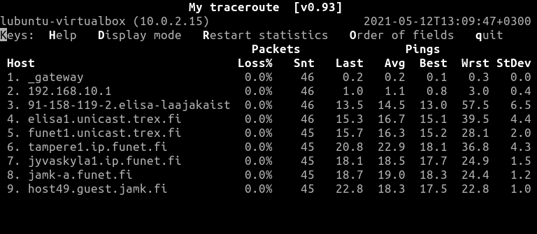
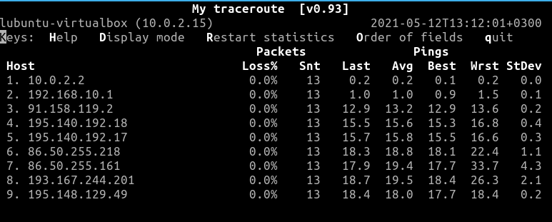

# Documentation for E01

Tässä on hienoa dokumentaatiotani

Ilman verkkoyhteyttä tietokoneilla pystyy laskemaan monimutkaisia laskuja nopeasti

lubuntu@lubuntu-virtualbox:~$ ping www.jamk.fi
PING www.jamk.fi (195.148.129.49) 56(84) bytes of data.
64 bytes from host49.guest.jamk.fi (195.148.129.49): icmp_seq=1 ttl=247 time=17.9 ms
64 bytes from host49.guest.jamk.fi (195.148.129.49): icmp_seq=2 ttl=247 time=17.8 ms
64 bytes from host49.guest.jamk.fi (195.148.129.49): icmp_seq=3 ttl=247 time=17.8 ms
64 bytes from host49.guest.jamk.fi (195.148.129.49): icmp_seq=4 ttl=247 time=18.0 ms
64 bytes from host49.guest.jamk.fi (195.148.129.49): icmp_seq=5 ttl=247 time=17.8 ms
^C
--- www.jamk.fi ping statistics ---
5 packets transmitted, 5 received, 0% packet loss, time 4007ms
rtt min/avg/max/mdev = 17.778/17.859/18.013/0.085 ms

lubuntu@lubuntu-virtualbox:~$ traceroute www.jamk.fi
traceroute to www.jamk.fi (195.148.129.49), 64 hops max
  1   10.0.2.2  1,608ms  0,126ms  0,110ms 
  2   *  *  * 
  3   *  *  * 
  4   *  *  * 
  5   *  *  * 

lubuntu@lubuntu-virtualbox:~$ traceroute --resolve-hostnames www.jamk.fi
traceroute to www.jamk.fi (195.148.129.49), 64 hops max
  1   10.0.2.2 (_gateway)  0,138ms  0,133ms  0,152ms 
  2   *  *  * 

Kuva 1

Kuva 2

